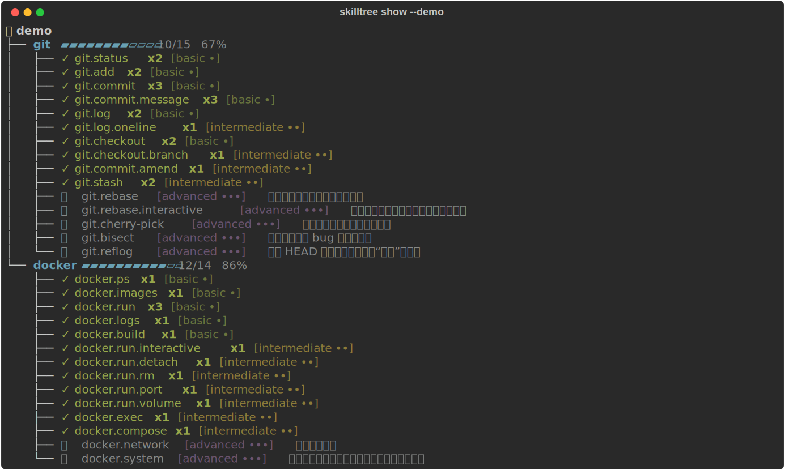
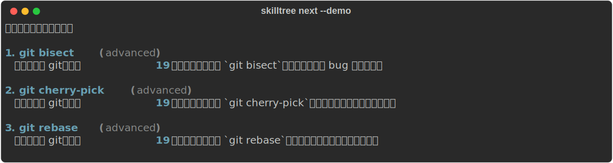
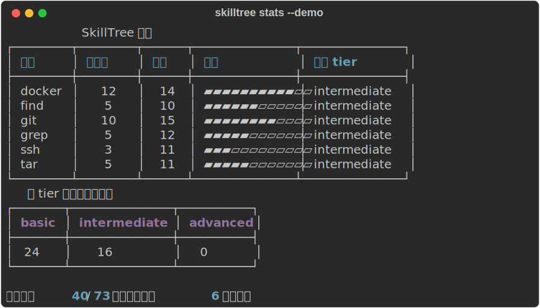

# 🌳 SkillTree

> Turn your shell history into a command-line skill tree. See what you've already
> mastered, what's still locked, and get a recommendation for the next flag worth learning.

SkillTree scans your shell history, matches every command against a curated
knowledge base of CLI tools and flags, and draws a tree in your terminal:
**green = unlocked**, **🔒 grey = unexplored**. Then it picks the next flag that's
just one tier above your current level in the tools you already use most.

<p align="center">
  
</p>

Then ask what to learn next, or get the big picture:

<p align="center">
  
  
</p>

> The screenshots above are produced by `python tools/make_screenshots.py` from the
> bundled `--demo` history, so they always reflect the current output.

## 🔒 Privacy first

Your shell history contains passwords, tokens and internal hostnames.
**SkillTree never uploads anything — all analysis runs entirely on your machine,
offline.** There is no network code in this project. Try it on the bundled,
de-identified sample first with `--demo`.

## Install

```bash
# from a clone
pipx install .
# or, for development
pip install -e ".[dev]"
```

Requires Python 3.11+.

## Usage

```bash
# Draw the whole tree from your detected shell history
skilltree show

# ...or play with the bundled sample, no real history touched
skilltree show --demo

# Focus on one tool, or only show what's still locked
skilltree show --tool git
skilltree show --locked

# What should I learn next?
skilltree next

# A summary: total unlocked, per-tool progress, tier distribution
skilltree stats

# Track your growth over time (stored locally in SQLite)
skilltree snapshot      # record today's state
skilltree growth        # chart unlocks over time

# Get a safe, sandboxed drill for an unexplored flag
skilltree practice
```

### Common options

| Option | Meaning |
| --- | --- |
| `--demo` | Use the bundled sample history; never reads your real history. |
| `--history PATH`, `-H` | Point at a specific history file. |
| `--shell {bash,zsh,plain,auto}`, `-s` | History format (default `auto`-detects). |
| `--kb PATH` | Use a custom knowledge-base directory. |
| `--no-color` | Disable colour. Glyphs also auto-degrade to ASCII on terminals that can't render emoji. |

## How it works

```
~/.zsh_history / ~/.bash_history
      │  history.py     parse → list of command strings (timestamps stripped)
      ▼
   ["git commit --amend -m x", "docker run -it --rm img", ...]
      │  tokenizer.py   shlex + pipe/&&/; split → (tool, subcommand, flags, args)
      ▼
   [{base: git, subcommand: commit, flags: [--amend, -m]}, ...]
      │  knowledge.py   load knowledge_base/*.yaml (the skill-tree definitions)
      ▼
      │  analyze.py     light up matched nodes, count frequency, track top tier
      ▼
      │  render.py      rich.tree → green unlocked / grey 🔒 locked
      └  recommend.py   next unused node one tier above your current level
```

The tokenizer is the heart of the project and handles the awkward cases:
quotes (`-m "msg"` isn't a flag), pipes and `&&`/`;` chains, clustered short
flags (`tar -xzf` → `-x -z -f`, getopt-style), value-taking flags
(`git -C path commit` → the subcommand is still `commit`), and `find`'s
single-dash *long* options (`-name` stays whole, never explodes into `-n -a -m -e`).

## The knowledge base

Each tool is one human-readable YAML file under
[`skilltree/knowledge_base/`](skilltree/knowledge_base). A node is either a
`subcommand` or a `flag`, tagged with a learning `tier`:

```yaml
tool: git
description: 分布式版本控制
nodes:
  - id: git.commit.amend
    type: flag
    tier: intermediate        # basic | intermediate | advanced
    invocation: "git commit --amend"
    desc: 修改上一次提交，不产生新提交
```

The match key (which tool / subcommand / flag a node represents) is derived by
running the `invocation` string through the **same** tokenizer used on your real
history, so the knowledge base and the parser can never drift apart.

### Adding a new tool

1. Drop a `yourtool.yaml` into `skilltree/knowledge_base/` following the schema above.
2. If the tool takes values for some flags (so they aren't mistaken for a
   subcommand), add them to `VALUE_TAKING_FLAGS` in `skilltree/tokenizer.py`.
3. Run `pytest`. Done — `skilltree show --tool yourtool` will pick it up.

Bundled tools: **git, docker, tar, grep, find, ssh** (73 nodes).

## Development

```bash
pip install -e ".[dev]"
pytest          # 38 tests covering the parser, tokenizer, KB and recommender
ruff check .
```

## License

MIT
